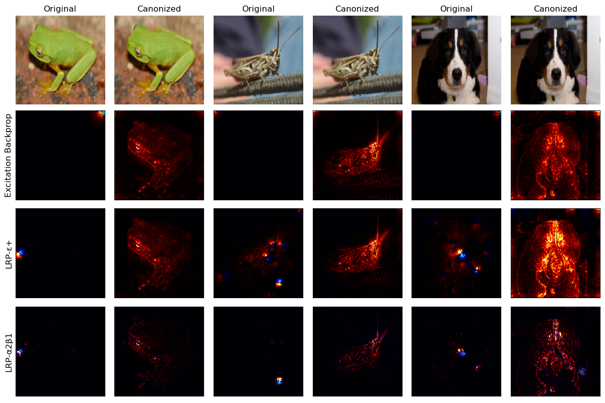
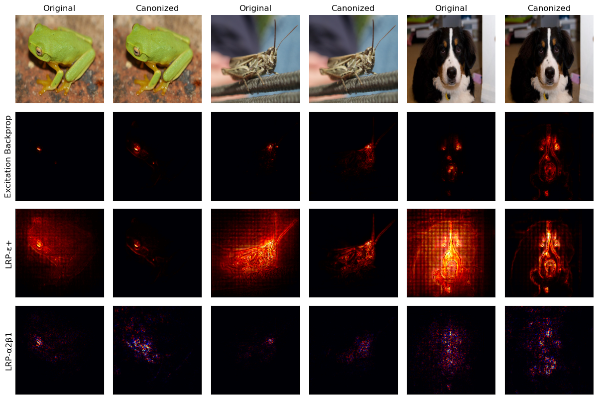
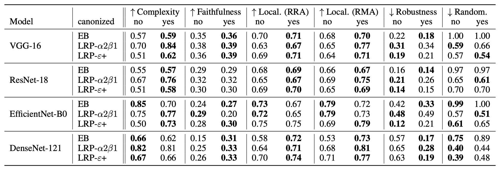
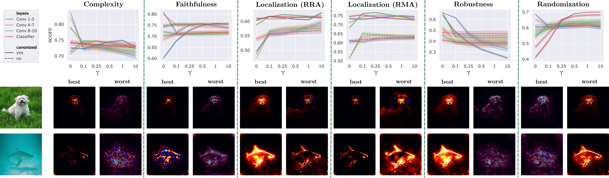

# XAI Evaluation Framework using Quantus

This repository includes the experiment code for the [paper](https://openaccess.thecvf.com/content/CVPR2023W/SAIAD/papers/Pahde_Optimizing_Explanations_by_Network_Canonization_and_Hyperparameter_Search_CVPRW_2023_paper.pdf) with the title "Optimizing Explanations by Network Canonization and Hyperparameter Search" .
The repository implements both experiments:
1. **XAI Evaluation for Canonization**: We measure the effectiveness of model canonization for various model architectures (VGG-16, ResNet-18, EfficientNet-B0, DenseNet-121, ...) with different datasets (ImageNet, Pascal-VOC, MS COCO, CLEVR-XAI) using a multitude of XAI metrics.
2. **XAI Hyperparameter Search**: We measure the impact of XAI hyperparemeter choices on various XAI metrics. Specifically, we use the LRP $\gamma$-rule wth different $\gamma$-values by layer in a VGG-13/VGG-16 model.

## Installation
The required libraries are listed in the requirements.txt file. Create a virtual environment **using Python 3.7**:

```
conda create -n xai_evaluation python=3.7.5
conda activate xai_evaluation
pip install -r requirements.txt
```

In addition, this repository uses the [Quantus](https://github.com/understandable-machine-intelligence-lab/Quantus) explainable AI evaluation library. However, in order to evaluate explanations for the VQA task (CLEVR-XAI, images *and* text as input), we slightly modified the Quantus implementation. In order to include these changes, you need to pull and install Quantus from our local [fork](https://github.com/frederikpahde/Quantus):

```
  git clone https://github.com/frederikpahde/Quantus.git
  cd Quantus
  git checkout quantus_vqa
  cd ..
  pip install ./Quantus --no-deps  
```


## Canonization Evaluation Experiments
After pulling the repository, the experiments can be run from the root directory as explained below.

Each experiment requires a configuration file that determines the dataset (see below), the model architecture (including different DenseNet, ResNet and EfficientNet architectures), the device  to be used etc. 

We parallelize the experiments by explanation method. Hence, we generate a seperate configuration file for each explainer (e.g., different LRP rules, with or without canonization). We further parallelize the experiments by classes for ImageNet and MS Coco. For ImageNet, we use 50 randomly selected classes, and for MS Coco, we use 10.


### Datasets
The following datasets are included in our experiments:
- **ImageNet**: Can be downloaded from https://www.image-net.org/. Information on how to download bounding box information are available here: https://image-net.org/download-bboxes.php 
- **CLEVR-XAI**: Follow the instructions [here](https://github.com/ahmedmagdiosman/clevr-xai) to download or generate the data including ground truth masks.
- **Pascal VOC**: Can be downloaded from http://host.robots.ox.ac.uk/pascal/VOC/
It includes bounding boxes as well as segmentation masks that can be used for localisation experiments.
- **MS Coco**: Can be downloaded from https://cocodataset.org/#download
This dataset also includes bounding box and segmentation masks. Segmentation masks are used for localization experiments in the paper.


Since MS Coco and Pascal VOC are multilabel datasets, each image is evaluated seperately for each class that it includes, using all instances of the single classes.

### Generating configuration files for experiments

In order to generate configuration files, run the following:

```
cd config_files
python config_generator_imagenet.py
python config_generator_VOC.py
python config_generator_MS.py
python config_generator_clevr.py
```
Each script generates configuration files for experiments using one dataset. Each script includes a dictionary called *USER_VARIABLES* which includes placeholders for user specific information like the dataset root and the device to be used. You need to populate these areas before running the scripts to generate valid configuration files. It is also straightforward to generate configuration files for different classes or to disable some explainers etc.

### Running the experiments
Given the config file the experiment can be started as follows:

```
python quantus_evaluation/start_evaluations.py --config_file $CONFIG_FILE_PATH
```
The results will be saved in the output folder given in the configuration file.

### Combining experiment results

For single class experiments(Imagenet and CLEVR-XAI), all evaluation outputs which are stored in the same directory, can be combined using the following script:

```
python quantus_evaluation/join_results.py --results_dir $RESULTS_DIR 
```
For MS Coco experiments, run the following script to merge results:

```
python quantus_evaluation/join_results_multilabel.py --results_dir $RESULTS_DIR 
```
For Pascal VOC experiments, you need to uncomment the *join_results* function and comment out the *join_classwise_results* in the main body of the script. Then you can run the script in the same way as the MS COCO experiments.

Below are some canonized and uncanonized explanations from ImageNet for DenseNet-161:


And for EfficientNet-B0:


The aggregated results for ImageNet experiments are shown below:


## XAI Hyperparameter Search
For hyperparameter seach experiments, we only use the Imagenet dataset. 
As for the other experiment, the configuration files can be generated by running

```
cd config_files
python config_generator_grid_search.py
```
And experiments can be run with the following command:

```
  python quantus_evaluation/grid_search_gamma.py --config_file $CONFIG_FILE_PATH --model_name resnet18
```

Aggregated results for XAI hyperparameter search experiments with VGG-13 on ImageNet are shown below:

